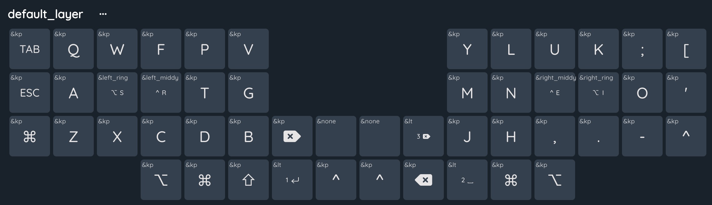

# Layout for my [Kyria](https://blog.splitkb.com/introducing-the-kyria/) split keyboard

Uses a slightly modified version of the [Colmak Mod-DH](https://colemakmods.github.io/mod-dh/) layout.

## Thumb cluster

